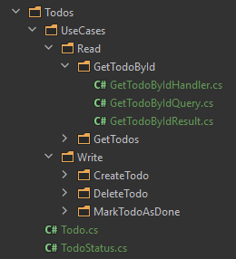
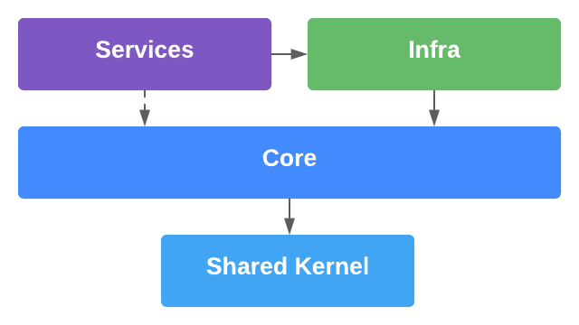

## Dotnet Clean Architecture

## Give a Star! :star:

If you liked my work and want to support me, please give it a star. Thanks!

## Introduction

This repository is a sandbox to experiment with new techniques, concepts, and technologies using **Clean Architecture** concepts. Here you will find **Domain-Driven Design (DDD)**, **Command Query Responsibility Segregation (CQRS)**, **SOLID Design Principles**, **Design Patterns**, and more.

## 1. How to Run :rocket:

### App 
```
docker-compose -f ./infra/docker-compose.yml -f ./infra/docker-compose.dev.yml -p clean-arch-dotnet-dev up -d
```

#### Swagger 
```
http://localhost:5010/swagger
```

### Tests
#### Unit, Integration, and End-to-End Tests
```
dotnet test CleanArchDotnet.sln
```

#### Load and Stress Tests
```
docker-compose -f ./infra/docker-compose.yml -f ./infra/docker-compose.test.yml -p clean-arch-dotnet-test up -d
```

## 2. Architecture :dart:

I'm using a **Clean Architecture** model, splitting the solution into **Core**, **Infra**, **Services**, and **Shared Kernel** layers.


<br>

### Core
The **Core** layer is responsible for the **Domain Entities**, **Value Objects**, **Domain Services**, **Domain Events**, **Use Cases** and **Abstractions** for communication with external layers. The main goal of this architecture is **to keep the Core, where the business lives, isolated from external dependencies implementation details**. 

The organization follows  **"The Screaming Architecture"** concept by **Uncle Bob** that purposes that your application architecture should scream what the system does. So I've preferred an organization by context rather than by component type.

Another principle that I'm following is **CQRS/CQS**, so the **Use Cases** are divided into **Write** or **Read** operations. Also, any **Use Case** has its owns **Command**, **Query**, **Result**, and **Handler**.



### Infra
The **Infra** layer is responsible for **Repository Concerns** (**Schemas**, **Repository Implementations**, and **Database Connections**), **Dependency Injection**, **Application Settings**, and **External Providers** for integration or services consumption.

### Services
These are entry points for **Core Use Cases** consumption. Can be **APIs**, **gRPC Services**, **Serverless Functions**, **Workers**, and more. As the domain does not depend upon, the consumption can be anything.

### Shared Kernel
These are common resources used between application layers. This project avoids **circular dependencies** between the layers.

## 3. Dependency Structure :electric_plug:



This Architecture follows the **Dependency Rule**, where **all dependencies points toward the architecture center** (AKA the Core).

The **Infra** layer depends upon the **Core** layer, while the **Core** uses abstractions with the **Dependency Inversion Principle** to consume infra resources, like data access.

The **Services** layer depends upon the **Infra** due to **Dependency Injection** and **Application Settings** needs. The Services layer depends upon the Core too and communicates with the Core through abstractions.

The **Shared Kernel** layer helps to avoid **circular dependencies** between projects. All projects depend upon the Shared Kernel.

## 4. Containers :whale:
The application is containerized using **Docker** and automated using **Docker Compose**.

The **docker-compose** file has **overridden versions** for **Dev** and **Load Tests environments**. I took the caution not to use default ports in containers to avoid conflict with other containers/servers that you may have using these ports.

Another point is that the application is working with **Entity Framework Core ORM**, and the **migrations are applied at the Application Startup**.

## 5. Tests :test_tube:

### Unit
**Fast** and **without external dependencies**. These tests are focused on the smaller units of code. The **Todo Entity** and the **DomainValidationProvider** are **unit tested** since they don't have extra dependencies to work.

### Integration
**With dependencies** and **focused on some internal functionality**. In this application context, the **Integration Tests** are focused on use cases. External dependencies could be **mocked** or **replaced** (I'm replacing the **Database** with an **In-memory** one). 

There are discussions about **how many assertions** you should have in a test, **the boundaries**, and soo. Here, following my experience and trying to be very comprehensive in these tests. I'm **testing from the input until the persisted data**.

### End-to-End
These tests focus on **test application entry points and returns**. To avoid inserting test data into the Database. **I'm using an In-memory Database one**.

### Load
There is a whole separated structure for Load Tests, with containers and tools. The application uses the K6 tool. The K6 idea is to simplify load test where basic JavaScript and HTTP knowledge is sufficient to build load tests.

#### Results
After executing the **Load Tests**, you can view results at `/tests/CleanArchDotnet.Tests.Load/k6/results` folder. The ```result.json``` shows a detailed report, and the ```export.json``` is a resumed version with a more general view.

#### Tests Execution
Different from other tests, the **Load Tests** are executed and analyzed separately.

## 6. Used Packages, Frameworks, and Tools :package:
- [ASPNET.Core](https://github.com/dotnet/aspnetcore) - Web Framework
- [EF.Core](https://github.com/dotnet/efcore) - Object Relational Mapper (ORM)
- [Database](https://www.postgresql.org/) - PostgreSQL
- [Docker](https://docs.docker.com/) - Container Management
- [Docker Compose](https://docs.docker.com/compose/) - Multi-Container Management
- [K6](https://k6.io/) - Load Tests Tool
- [Mediatr](https://github.com/jbogard/MediatR) - Use Cases Decoupling and Behaviours Pipelines
- [FluentValidation](https://github.com/FluentValidation/FluentValidation) - Data Validation
- [Bogus](https://github.com/bchavez/Bogus) - Fake data generation for tests
- [FluentAssertions](https://github.com/fluentassertions/fluentassertions) - Add fluent pattern to tests assertions
- [MicrosoftPackages](https://github.com/orgs/dotnet/repositories) - Dependency Injection, In-Memory Database, and more

## 7. Used Patterns and Principles :books:
- [Clean Architecture](https://blog.cleancoder.com/uncle-bob/2012/08/13/the-clean-architecture.html)
- [CQRS/CQRS](https://martinfowler.com/bliki/CQRS.html)
- [SOLID](https://blog.cleancoder.com/uncle-bob/2020/10/18/Solid-Relevance.html)
- [Domain Validation](https://martinfowler.com/articles/replaceThrowWithNotification.html)
- [Domain Events](https://docs.microsoft.com/en-us/dotnet/architecture/microservices/microservice-ddd-cqrs-patterns/domain-events-design-implementation)
- [Aggregates](https://martinfowler.com/bliki/DDD_Aggregate.html)
- [Value Objects](https://martinfowler.com/bliki/ValueObject.html)
- [Fail-Fast Principle](https://enterprisecraftsmanship.com/posts/fail-fast-principle/)
- [Rich Domain Modeling](https://blog.codecentric.de/en/2019/10/ddd-vs-anemic-domain-models/)
- [Mediator](https://refactoring.guru/design-patterns/mediator)
- [Repository Pattern](https://docs.microsoft.com/en-us/dotnet/architecture/microservices/microservice-ddd-cqrs-patterns/infrastructure-persistence-layer-design)
- [AAA Test Pattern](https://medium.com/@pjbgf/title-testing-code-ocd-and-the-aaa-pattern-df453975ab80)